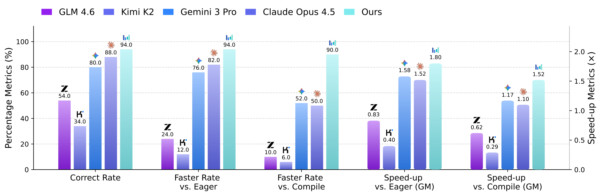
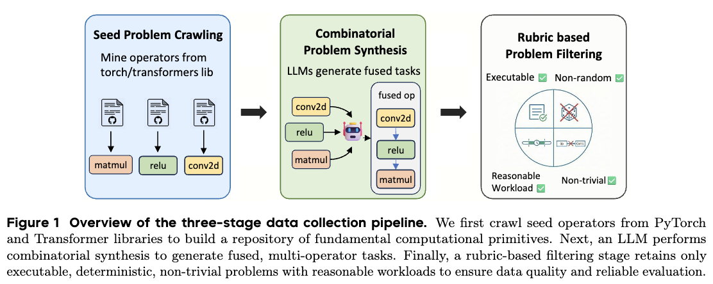
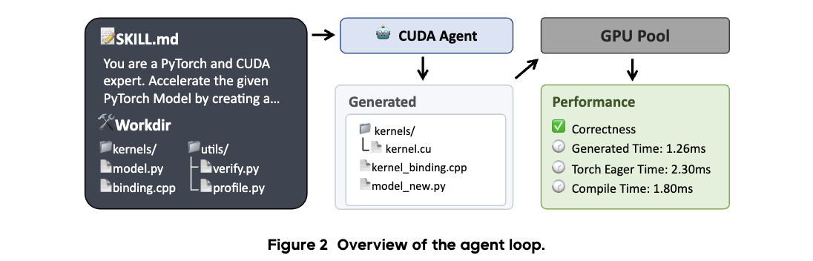

# CUDA-Agent: Large-Scale Agentic RL for High-Performance CUDA Kernel Generation

Project page: [CUDA-Agent.github.io](https://nwiad.github.io/CUDA-Agent.github.io/)

## 1. Project Overview

CUDA-Agent is a large-scale agentic RL system for automatic CUDA kernel generation and optimization.  
Its core idea is to move from one-shot code generation to multi-turn optimization, and continuously improve CUDA coding and performance-tuning capability through scalable data synthesis, executable feedback environments, and stable RL training strategies.

CUDA-Agent achieves state-of-the-art performance on KernelBench, consistently outperforming the `torch.compile` baseline across difficulty levels and showing strong gains on harder cases.




## 2. Dataset Release: CUDA-Agent-Ops-6K

We released the training dataset **CUDA-Agent-Ops-6K**:

- Dataset URL: [BytedTsinghua-SIA/CUDA-Agent-Ops-6K](https://huggingface.co/datasets/BytedTsinghua-SIA/CUDA-Agent-Ops-6K)
- Scale: 6,000 training samples
- Construction pipeline:
  - Collect reference operators from `torch` and `transformers`
  - Use an LLM to compose multiple operators into fused tasks
  - Apply rule-based filtering to keep executable, deterministic, and non-trivial samples
- Filtering criteria:
  - Must execute correctly in both eager mode and `torch.compile`
  - Remove stochastic operators and degenerate outputs
  - Control runtime range and remove samples highly similar to KernelBench tests to reduce contamination risk



## 3. `agent_workdir` Overview

`agent_workdir` is a standardized agent workspace example for the full loop:
implement CUDA kernels -> compile -> verify correctness -> profile performance -> iterate.

Key files in this directory:

- `SKILL.md`: workflow constraints and optimization rules for agent execution
- `model.py`: original PyTorch baseline model
- `model_new.py`: optimized model using the custom CUDA extension
- `binding.cpp` / `binding_registry.h`: shared Python binding registration infrastructure
- `kernels/`: custom CUDA/C++ kernels and their bindings
- `utils/compile.py` + `utils/compile.sh`: extension build scripts
- `utils/verification.py`: correctness validation script
- `utils/profiling.py`: performance comparison against baseline and `torch.compile`


Common commands (run inside `agent_workdir`):

```bash
bash utils/compile.sh
python3 -m utils.verification
python3 -m utils.profiling
```

